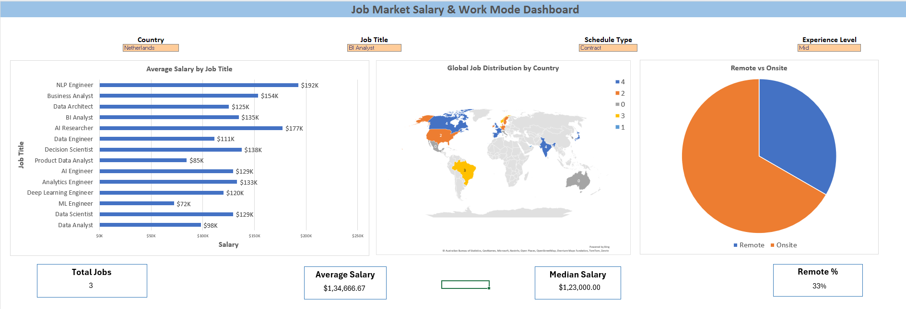

# Interactive Sales & Customer Insights Dashboard

This project is an interactive **Excel dashboard** designed to analyze e-commerce sales performance, customer behavior, and product category trends.

The dashboard allows users to explore sales insights using dynamic filters and visualizations.

---

## Dashboard Preview

---

## Project Features

### Interactive Filters
The dashboard allows filtering by:

- Country
- Product Category
- Customer Type
- Order Mode

These filters dynamically update all charts and metrics.

---

## Key Metrics (KPIs)

The dashboard calculates and displays:

- Total Orders
- Average Revenue per Order

These indicators help quickly understand overall sales performance.

---

## Visualizations Used

The dashboard includes four main visualizations:

1. **Orders by Country**  
   Column chart showing the distribution of orders across different countries.

2. **Revenue by Category**  
   Horizontal bar chart comparing revenue generated by different product categories.

3. **Monthly Sales Trend**  
   Line chart illustrating revenue trends across different months.

4. **Customer Type Share**  
   Pie chart showing the proportion of new vs returning customers.

---

## Dataset

The dataset contains **synthetic e-commerce transaction data** created for educational and portfolio purposes.

It simulates **5000+ sales transactions** across multiple countries and product categories.

The dataset includes:

- Order ID
- Order Date
- Country
- Product Category
- Product Name
- Quantity
- Unit Price
- Customer Type
- Order Mode

Additional calculated fields were created:

- Revenue
- Month
- Year

---

## Tools Used

- Microsoft Excel
- Pivot Tables
- Pivot Charts
- Slicers
- Excel Formulas
- Data Visualization
- Dashboard Design

---

## Author

**Dhruvit Goswami**

This project was created as part of a data analytics portfolio.
